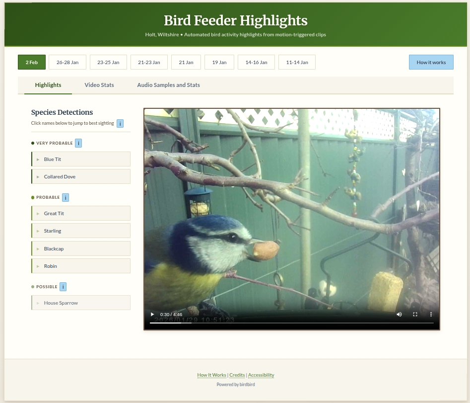
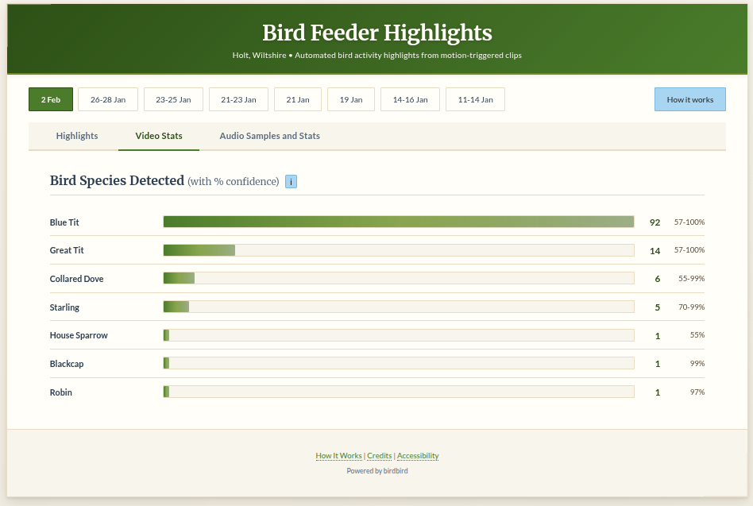
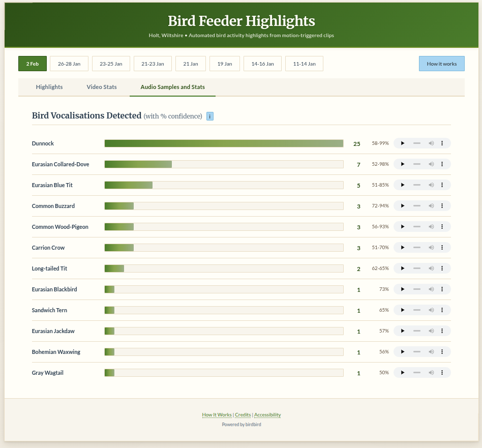
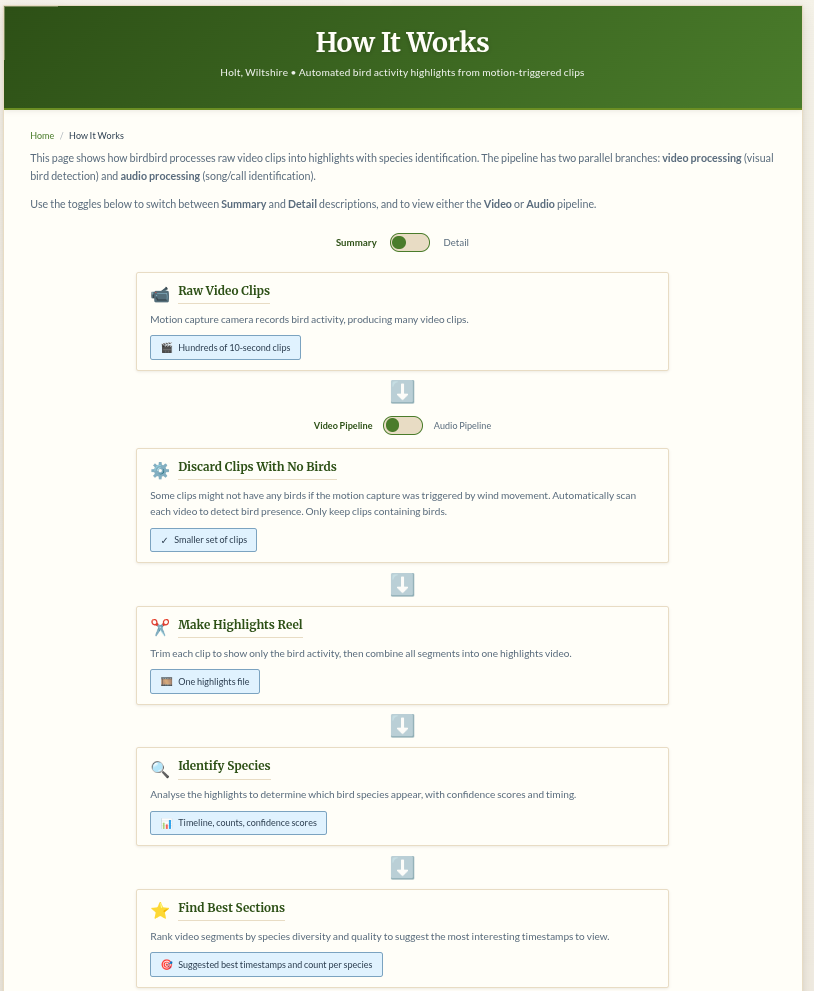

# birdbird

> Automated bird feeder video analysis - turn hundreds of motion-triggered clips into highlight reels with species identification


[](https://github.com/pre-commit/pre-commit)
[](https://mypy-lang.org/)
[](https://birdbird.rossarn.workers.dev/)

## What is this?

If you have a bird feeder camera that captures motion-triggered clips, you probably have:
- Hundreds of 10-second videos to review
- Many false positives (wind, shadows, leaves)
- No easy way to identify which birds visited
- No quick way to find the "good" footage

**birdbird** solves this by automatically:
1. **Filtering** clips to find actual bird activity (eliminates ~70% of false positives)
2. **Identifying** species using AI vision models
3. **Detecting** bird songs from audio tracks
4. **Generating** highlight reels of the best moments
5. **Publishing** to a web viewer with timestamps and audio clips

### Example Output

From a batch of 498 motion-triggered clips (4 hours of footage), birdbird automatically produces:
- A filtered set of 149 clips with actual birds (29.9% detection rate)
- A 23-minute highlight reel showing only active segments
- Species identifications with confidence scores and timestamps
- Bird song detections with audio clips
- An interactive web viewer to explore the results

[See a live example →](https://birdbird.rossarn.workers.dev/)

### Screenshots

**Highlights viewer** — browse the highlight reel with seek buttons per species



**Species detections** — visual species identified with sighting counts and confidence ranges



**Bird song detections** — vocalisation detections with inline audio playback



**How it works** — interactive explanation of the processing pipeline



## Quick Start

> **First time?** See [Installation](#installation) below for system requirements.
> **Need a camera?** See [BIRD_CAMERAS.md](BIRD_CAMERAS.md) for compatible hardware (works with any camera that saves video clips to SD card).

```bash
# Install birdbird
git clone https://github.com/rssrn/birdbird.git
cd birdbird
python3 -m venv .venv
source .venv/bin/activate
pip install -e .

# Process your clips (filter + highlights + songs)
birdbird process /path/to/your/clips

# Test with just 10 clips first
birdbird process /path/to/your/clips --limit 10
```

This will create:
- `birdbird/working/` - Temporary processing files (symlinks to filtered clips, intermediate data)
- `birdbird/working/filter/detections.json` - Bird detection timestamps
- `birdbird/assets/highlights.mp4` - Concatenated highlight reel
- `birdbird/assets/songs.json` - Bird song detections
- `birdbird/assets/song_clips/` - Audio clips per species

---

## For Users: Getting Started

### Installation

**System Requirements:**
- Python 3.10 or later
- ffmpeg (for video processing)

**Supported Platforms:**
- **Linux** - Tested on Ubuntu 22.04 (primary development platform)
- **macOS** - Untested, but toolchain should work (Python, ffmpeg, and all dependencies are cross-platform). Please report any issues.
- **Windows** - Untested, may require additional setup for ffmpeg and path handling

```bash
# Ubuntu/Debian
sudo apt install python3 python3-venv ffmpeg

# macOS
brew install python@3.10 ffmpeg

# Verify
python3 --version  # Should be 3.10+
ffmpeg -version
```

**Install birdbird:**

```bash
# Clone and setup
git clone https://github.com/rssrn/birdbird.git
cd birdbird
python3 -m venv .venv
source .venv/bin/activate  # On Windows: .venv\Scripts\activate
pip install -e .
```

Python packages (installed automatically):
- **ultralytics** - YOLOv8 object detection
- **opencv-python** - Video/image processing
- **typer** - CLI framework
- **tqdm** - Progress bars
- **birdnet-analyzer** - Bird song detection
- **boto3** - Cloud publishing (optional)

### Basic Usage

**Process a batch of clips:**

```bash
# All-in-one: filter + highlights + songs
birdbird process /path/to/clips

# Or run steps individually:
birdbird filter /path/to/clips                    # 1. Find clips with birds
birdbird highlights /path/to/clips                # 2. Generate highlight reel
birdbird songs /path/to/clips                     # 3. Detect bird songs
```

**Useful options:**

```bash
# Test with 10 clips first
birdbird process /path/to/clips --limit 10

# Adjust bird detection sensitivity (0.0-1.0, higher = more confident, default: 0.2)
# Lower values detect more birds but may include false positives
# Higher values (e.g., 0.3-0.5) reduce false positives but may miss some birds
birdbird filter /path/to/clips --bird-conf 0.3

# Clear previous results and reprocess
birdbird process /path/to/clips --force
```

### Input Format

birdbird expects video files from motion-triggered cameras:
- **Format**: AVI, MP4, or other ffmpeg-compatible formats
- **Directory structure**: All clips in one directory (e.g., `20260114/`)
- **Filename convention**: `DDHHmmss00.avi` (day + time; month/year from parent directory name)

**Camera compatibility:** Works with any camera that saves video files locally (SD card storage). See [BIRD_CAMERAS.md](BIRD_CAMERAS.md) for a detailed guide on compatible hardware, including budget options (£30+), commercial smart feeders, and open-source alternatives.

Tested with Wilde & Oakes Camera Bird Feeder (£30 from B&M, UK) producing MJPEG AVI files (1440x1080, 30fps, ~10s clips, ~27MB each).

### Configuration

**Optional:** Create `~/.birdbird/config.json` for location-based species filtering:

```bash
mkdir -p ~/.birdbird
cat > ~/.birdbird/config.json << 'EOF'
{
  "location": {
    "lat": 51.35,
    "lon": -2.15
  }
}
EOF
```

This helps BirdNET focus on species in your region, speeding up audio analysis. You can override with `--lat`/`--lon` flags.

---

## Advanced Features

### Visual Species Identification

The `species` command uses **BioCLIP** (vision-language model) to identify bird species from video frames. This requires a GPU for reasonable performance. birdbird supports two processing modes:

1. **Remote GPU** (recommended, tested) - Offload processing to a remote machine via SSH
2. **Local GPU** (untested, may cause system instability) - Run BioCLIP on your local GPU

**Option 1: Setup remote GPU (recommended):**

1. On the remote machine:
   ```bash
   python3 -m venv ~/bioclip_env
   source ~/bioclip_env/bin/activate
   pip install bioclip torch
   ```

2. On your local machine, configure SSH access:
   ```bash
   ssh-copy-id user@remote-hostname
   ```

3. Add to `~/.birdbird/config.json`:
   ```json
   {
     "species": {
       "processing": {
         "mode": "remote",
         "remote": {
           "host": "user@remote-hostname",
           "shell": "bash",
           "python_env": "~/bioclip_env"
         }
       }
     }
   }
   ```

4. **(Optional)** Customize species labels - By default, birdbird uses a built-in list of 67 common UK garden birds. To customize for your region or further narrow the search space, create `~/.birdbird/bird_labels.txt`:
   ```
   Blue Tit
   Great Tit
   Robin
   Blackbird
   House Sparrow
   ```

   Then add to your config:
   ```json
   {
     "species": {
       "processing": { ... },
       "labels_file": "~/.birdbird/bird_labels.txt"
     }
   }
   ```

   **Why this matters:** BioCLIP is a general-purpose vision-language model trained on millions of images including plants, animals, fungi, and more. Without restricting the search space to specific bird species, it performs much slower because it's comparing each frame against a massive vocabulary. The built-in default (67 UK garden birds) provides a good balance for most UK users. For other regions or to further optimize performance, create a custom list with only birds you're likely to see in your area - this can speed up inference 10-100x and improve accuracy by eliminating irrelevant categories. BioCLIP will rank each frame against only these labels and return confidence scores for each species.

5. Run species detection:
   ```bash
   birdbird species /path/to/clips
   # Or include in process step:
   birdbird process /path/to/clips --species
   ```

This produces `species.json` with timestamps and confidence scores, plus `best_clips.json` for web viewer navigation.

**Option 2: Setup local GPU (untested):**

> ⚠️ **Warning:** Local GPU processing is untested and may cause system slowdown or instability. The BioCLIP model and PyTorch can be resource-intensive. Use at your own risk. Remote GPU processing (Option 1) is strongly recommended.

1. Install GPU dependencies:
   ```bash
   pip install -e ".[gpu]"
   ```

2. Configure in `~/.birdbird/config.json`:
   ```json
   {
     "species": {
       "processing": {
         "mode": "local"
       }
     }
   }
   ```

3. Run species detection:
   ```bash
   birdbird species /path/to/clips
   ```

**Note:** Local mode requires CUDA-compatible GPU and drivers. If CUDA is not available, it will fall back to CPU (which will be extremely slow). Verify GPU availability with `python -c "import torch; print(torch.cuda.is_available())"` after installing the gpu dependencies.

### Publishing to Web

Publish your highlights to cloud storage and deploy a web viewer to browse results.

**Quick setup:**

1. **Choose your storage backend** (see Infrastructure Options below)
2. Create `~/.birdbird/cloud-storage.json` with your storage credentials
3. Deploy the web viewer (see Hosting the Web Viewer below)
4. Publish:
   ```bash
   birdbird publish /path/to/clips
   ```

The web viewer provides:
- Video player with species seek buttons
- Audio statistics tab with song clips
- Date range filtering for multiple batches
- Responsive design for mobile/desktop

#### Infrastructure Options

**Storage Backend:**

birdbird uses the S3 API via boto3, so it works with any S3-compatible storage. Tested and untested options:

- **Cloudflare R2** (recommended, tested)
  - Free tier: 10GB storage, no egress fees
  - Fast CDN-backed delivery
  - Create bucket in [Cloudflare dashboard](https://dash.cloudflare.com/?to=/:account/r2)
  - Config example:
    ```json
    {
      "r2_access_key_id": "YOUR_KEY",
      "r2_secret_access_key": "YOUR_SECRET",
      "r2_bucket_name": "birdbird-highlights",
      "r2_account_id": "YOUR_ACCOUNT_ID",
      "r2_endpoint": "https://YOUR_ACCOUNT_ID.r2.cloudflarestorage.com"
    }
    ```

- **AWS S3** (untested, should work)
  - Standard S3 pricing applies (storage + bandwidth)
  - Config example:
    ```json
    {
      "r2_access_key_id": "YOUR_AWS_ACCESS_KEY",
      "r2_secret_access_key": "YOUR_AWS_SECRET_KEY",
      "r2_bucket_name": "birdbird-highlights",
      "r2_account_id": "us-east-1",
      "r2_endpoint": "https://s3.us-east-1.amazonaws.com"
    }
    ```

- **Other S3-compatible storage** (untested)
  - DigitalOcean Spaces, Backblaze B2, Wasabi, MinIO, etc.
  - Adjust `r2_endpoint` and credentials accordingly
  - May require CORS configuration for web viewer access

**Note:** Despite the `r2_` prefix in config keys (historical naming), these settings work with any S3-compatible API.

#### Hosting the Web Viewer

The viewer is static HTML/CSS/JS (no build step required) located in `src/birdbird/templates/`. Deploy it anywhere that serves static files:

**Option 1: Cloudflare Pages** (recommended if using R2)
```bash
# From birdbird-website repo
git add . && git commit -m "Update viewer"
git push  # Auto-deploys via Cloudflare Pages integration
```

**Option 2: GitHub Pages** (free, simple)
```bash
# Copy templates to gh-pages branch
cp -r src/birdbird/templates/* docs/
git add docs/ && git commit -m "Deploy viewer"
git push origin main
# Enable GitHub Pages in repo settings → Pages → Source: docs/
```

**Option 3: Netlify/Vercel** (free tier, drag-and-drop)
- Create new site
- Upload `src/birdbird/templates/` directory
- No build configuration needed

**Option 4: Self-hosted** (any web server)
```bash
# nginx example
sudo cp -r src/birdbird/templates/* /var/www/birdbird/
# Configure nginx to serve /var/www/birdbird/

# Or simple Python server for testing
cd src/birdbird/templates && python3 -m http.server 8000
```

**Option 5: Local development**
```bash
npx serve -l 3000 src/birdbird/templates
# Open http://localhost:3000/index.html
```

**Important:** Configure CORS on your storage bucket to allow requests from your viewer domain. For R2:
```json
[
  {
    "AllowedOrigins": ["https://yourdomain.com", "http://localhost:3000"],
    "AllowedMethods": ["GET"],
    "AllowedHeaders": ["*"]
  }
]
```

---

## For Developers: Contributing

### Development Setup

**Clone and install:**

```bash
git clone https://github.com/rssrn/birdbird.git
cd birdbird
python3 -m venv .venv
source .venv/bin/activate
pip install -e ".[test]"  # Includes test dependencies
```

**Install pre-commit hooks:**

```bash
npm install
pre-commit install
```

This sets up:
- HTML validation (html-validate)
- JavaScript linting (eslint)
- CSS linting (stylelint)
- Spell checking (cspell - British English by default)
- Security lint (bandit - checks Python code for common security issues)
- Type checking (mypy - static type analysis of Python code)
- Python tests (pytest - all tests including mocked unit tests)
- Accessibility reminder (prompts you to run `npm run test:a11y` manually before deploying)

**Changing spell check language:** Edit `.cspell.json` and change `"language": "en-GB"` to your preferred locale (e.g., `"en-US"` for American English, `"fr"` for French, etc.).

**Code quality checks:**

```bash
# Type checking (mypy)
.venv/bin/mypy src/birdbird

# Static security analysis of birdbird source code (bandit)
.venv/bin/bandit -r src/birdbird/ -c pyproject.toml

# Dependency vulnerability audit (uses OSV vulnerability database)
.venv/bin/pip-audit --vulnerability-service osv --skip-editable
```

Both tools are included in dev dependencies (`pip install -e ".[test]"`). Bandit runs automatically in pre-commit; pip-audit runs in pre-push. Bandit skip rules are configured in `pyproject.toml` under `[tool.bandit]`.

**Note:** Use `--vulnerability-service osv` for pip-audit instead of the default PyPI service, which has reliability issues.

**Run tests:**

```bash
# All tests (runs in pre-commit)
.venv/bin/pytest

# Only slow/integration tests
.venv/bin/pytest -m slow

# With coverage
.venv/bin/pytest --cov=src/birdbird --cov-report=term-missing
```

**Test the web viewer locally:**

```bash
# Terminal 1: Start local server
npm run serve

# Terminal 2: Run accessibility tests
npm run test:a11y

# Or manually:
npx serve -l 3000 src/birdbird/templates
# Open http://localhost:3000/index.html
```

### Architecture

**Directory structure:**

```
src/birdbird/
├── __init__.py      # Package metadata
├── cli.py           # CLI entry point (Typer)
├── config.py        # User config (~/.birdbird/config.json)
├── paths.py         # Path management utilities
├── detector.py      # YOLOv8 bird detection
├── species.py       # BioCLIP species identification
├── songs.py         # BirdNET audio analysis
├── filter.py        # Batch filtering logic
├── highlights.py    # Highlight reel generation
├── best_clips.py    # Best viewing windows per species
├── frames.py        # Frame extraction and scoring
├── publish.py       # R2 upload with batch management
└── templates/       # Web viewer (HTML/CSS/JS)
```

**Key concepts:**

- **src-layout**: Python package lives in `src/birdbird/`, not top-level
- **Entry point**: Installed as `birdbird` command via `pyproject.toml`
- **Config files**: User settings in `~/.birdbird/` (not in project repo)
- **Output structure**: Creates `birdbird/working/` for temp files and `birdbird/assets/` for final outputs

### How It Works

**Detection pipeline:**

1. **Filter** - YOLOv8-nano detects birds in sampled frames
   - Samples ~4 frames in first second (motion trigger), then 1fps
   - COCO class 14 ("bird") with 0.2 confidence threshold
   - Creates symlinks in `birdbird/working/filter/clips/` and saves `detections.json`
   - Processes ~10s clips in ~2.3 seconds on CPU

2. **Highlights** - Extract and concatenate active segments
   - Binary search on detection timestamps to find segment boundaries
   - Concatenates segments with ffmpeg into `highlights.mp4`
   - Typical 500-clip batch: 4 hours → 23 minutes of highlights

3. **Songs** - BirdNET audio analysis
   - Extracts audio from clips, runs BirdNET classifier
   - Location-based filtering (if configured) for faster analysis
   - Saves `songs.json` + audio clips per species in `song_clips/`

4. **Species** (optional) - BioCLIP visual identification
   - Samples frames from highlights (default: 6/minute)
   - SSH transfer to remote GPU for inference
   - Custom species labels (Blue Tit, Robin, etc.)
   - Saves `species.json` with timestamps and `best_clips.json` for navigation

5. **Publish** (optional) - Upload to Cloudflare R2
   - Manages YYYYMMDD-NN batch naming
   - Updates `latest.json` index for web viewer
   - Prompts before deleting old batches (keeps 5)

**Tech stack:**
- **Detection**: YOLOv8-nano (Ultralytics) on CPU
- **Species ID**: BioCLIP vision-language model on remote GPU
- **Audio**: BirdNET-Analyzer with location filtering
- **Video processing**: ffmpeg for extraction/concatenation
- **Web viewer**: Vanilla HTML/CSS/JS (no build step)
- **Storage**: Cloudflare R2 (S3-compatible)

### Testing

**Test organization:**

```bash
tests/
├── conftest.py              # Shared fixtures (mock YOLO, cv2, S3)
├── test_config.py           # Config loading, validation
├── test_paths.py            # Path utilities
├── test_best_clips.py       # Sliding window algorithm
├── test_publish.py          # Date parsing, batch IDs (pure)
├── test_songs.py            # BirdNET CSV parsing (pure)
├── test_detector.py         # YOLO bird detection (mocked)
├── test_filter_mock.py      # Clip filtering pipeline (mocked)
├── test_highlights_mock.py  # Highlight reel generation (mocked)
├── test_songs_mock.py       # Audio extraction + BirdNET (mocked)
├── test_publish_mock.py     # R2 upload + cleanup (mocked)
└── test_frames_mock.py      # Frame scoring + extraction (mocked)
```

**167 tests total** - Layer 1 (pure unit tests) + Layer 2 (mocked unit tests), all fast.

**Pre-commit hooks** run all tests automatically. Use `@pytest.mark.slow` to mark integration tests that need real dependencies.

```python
@pytest.mark.slow
def test_real_yolo_detection():
    # Integration test with actual YOLO model
    ...
```

### Contributing

Contributions welcome! Areas for improvement:

- **Multiple bird detection** - Currently returns first detection only; could track multiple birds per frame
- **Corrupted file handling** - Better detection/handling of corrupted MJPEG frames
- **Database backend** - Structured storage for stats/graphs (species counts, time patterns)
- **Email reports** - Automated summaries with highlights

To contribute:
1. Fork the repo and create a feature branch
2. Make your changes with tests
3. Run pre-commit hooks: `pre-commit run --all-files`
4. Submit a pull request

---

## Project Status

**Completed:**
- ✅ Bird detection filter (YOLOv8)
- ✅ Highlight reel generation
- ✅ Visual species identification (BioCLIP)
- ✅ Audio species detection (BirdNET)
- ✅ Web viewer with R2 publishing
- ✅ Accessibility testing (pa11y)

**Roadmap:**
- 🔄 Highlight images (species-specific frame extraction)
- 🔄 Best action sequence (algorithm to find most interesting 30-second segments)
- 🔄 Email reports with statistics
- 🔄 Database backend for historical trends

---

## License

MIT License - see [LICENSE](LICENSE) for details.

## Credits

Built with:
- [YOLOv8](https://github.com/ultralytics/ultralytics) - Object detection
- [BioCLIP](https://github.com/Imageomics/pybioclip) - Species identification
- [BirdNET-Analyzer](https://github.com/kahst/BirdNET-Analyzer) - Audio classification
- [ffmpeg](https://ffmpeg.org/) - Video processing

[See full credits and licenses](src/birdbird/templates/credits.html)
